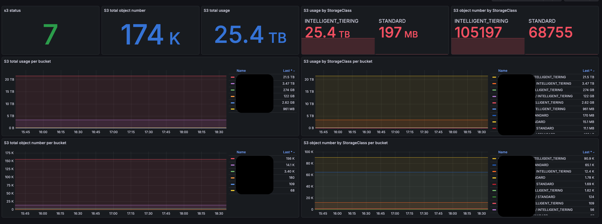

# S3 bucket Exporter

S3-bucket-exporter collects information about size and object list about all the buckets accessible by user.
Works with AWS and any S3 compatible endpoints (Minio, Ceph, Localstack, etc).

## Key Features

- **Multiple Auth Methods**: Access keys, IAM role, Web Identity (IRSA), EC2 instance profile — auto-detected
- **Credential Caching**: Credentials are cached and refreshed proactively before expiry
- **Parallel Collection**: Bucket metrics are collected concurrently
- **Partial Failure Visibility**: `s3_failed_bucket_count` metric shows how many buckets failed without hiding partial results
- **Flexible Configuration**: Supports both environment variables and command-line flags
- **Per Storage Class**: Metrics broken down by storage class (STANDARD, GLACIER, etc.)
- **S3-Compatible**: Works with AWS and any S3-compatible endpoint (MinIO, Ceph, Localstack, etc.)

## Metrics

Endpoint-level metrics:
  - `s3_endpoint_up` — 1 if all buckets were listed successfully, 0 otherwise
  - `s3_bucket_count` — total number of monitored buckets
  - `s3_failed_bucket_count` — number of buckets that failed to list
  - `s3_total_size{versionStatus="current|noncurrent"}` — total size across all buckets, by storage class and version status
  - `s3_total_object_number{versionStatus="current|noncurrent"}` — total object count across all buckets, by storage class and version status
  - `s3_total_delete_markers` — total delete marker count across all buckets
  - `s3_list_total_duration_seconds` — total time spent listing all buckets
  - `s3_auth_attempts_total` — authentication attempts by method and status

Bucket-level metrics:
  - `s3_bucket_size{versionStatus="current|noncurrent"}` — size per bucket, storage class, and version status
  - `s3_bucket_object_number{versionStatus="current|noncurrent"}` — object count per bucket, storage class, and version status
  - `s3_bucket_delete_markers` — delete marker count per bucket
  - `s3_list_duration_seconds` — time spent listing objects in a bucket

## Getting Started

### Basic Usage

Run from command-line:

```sh
./s3-bucket-exporter [flags]
```

### Example with Minimal Parameters

```sh
./s3-bucket-exporter -s3_endpoint=http://127.0.0.1:9000 -s3_access_key=minioadmin -s3_secret_key=minioadmin
```

### Docker Example

```sh
docker run -p 9655:9655 -d \
  -e S3_ENDPOINT=http://127.0.0.1:9000 \
  -e S3_ACCESS_KEY=minioadmin \
  -e S3_SECRET_KEY=minioadmin \
  -e S3_BUCKET_NAMES=my-bucket-name \
  ghcr.io/tropnikovvl/s3-bucket-exporter:latest
```

### AWS Example

```sh
./s3-bucket-exporter \
  -s3_access_key ABCD12345678 \
  -s3_secret_key mySecretKey \
  -s3_bucket_names=my-bucket-name \
  -s3_region=us-east-1
```

> Note: For AWS, all buckets must be in the same region to avoid "BucketRegionError" errors or manually limit the list of buckets. An example of IAM policy can be found [here](./deploy/aws/iam-policy.json)

### Helm Example

```sh
helm install s3-bucket-exporter \
  --namespace s3-bucket-exporter \
  --create-namespace oci://ghcr.io/tropnikovvl/chart/s3-bucket-exporter \
  --version 2.4.0
```

## Configuration

The exporter supports both command-line arguments and environment variables (arguments take precedence).

### Main Configuration Options

| Environment Variable | Argument | Description | Default | Example |
|---------------------|----------|-------------|---------|---------|
| S3_BUCKET_NAMES | -s3_bucket_names | Comma-separated list of buckets to monitor (empty = all buckets) | | my-bucket,other-bucket |
| S3_ENDPOINT | -s3_endpoint | S3 endpoint URL | s3.us-east-1.amazonaws.com | http://127.0.0.1:9000 |
| S3_ACCESS_KEY | -s3_access_key | AWS access key ID | | AKIAXXXXXXXX |
| S3_SECRET_KEY | -s3_secret_key | AWS secret access key | | xxxxxxxxxxxxx |
| S3_REGION | -s3_region | AWS region | us-east-1 | eu-west-1 |
| S3_FORCE_PATH_STYLE | -s3_force_path_style | Use path-style addressing | false | true |
| S3_SKIP_TLS_VERIFY | -s3_skip_tls_verify | Skip TLS certificate verification | false | true |
| LISTEN_PORT | -listen_port | Port to listen on | :9655 | :9123 |
| LOG_LEVEL | -log_level | Logging level | info | debug |
| LOG_FORMAT | -log_format | Log format | text | json |
| SCRAPE_INTERVAL | -scrape_interval | Metrics update interval | 5m | 30s |

> Warning: For security reasons, avoid passing credentials via command line arguments

## Authentication

The exporter automatically detects the authentication method based on the provided configuration. Credentials are cached and refreshed proactively before expiry.

### Supported Authentication Methods

| Method | When used | Cache TTL |
|--------|-----------|-----------|
| **Access Keys** | `S3_ACCESS_KEY` + `S3_SECRET_KEY` set | Never expires |
| **IAM Role** (assume role) | `S3_ROLE_ARN` set | 45 min |
| **Web Identity** | `S3_ROLE_ARN` + `S3_WEB_IDENTITY` set | 45 min |
| **IAM Instance Profile** | No credentials provided | 30 min |

### Security Features

- **TLS Verification**: Optional TLS certificate verification (`S3_SKIP_TLS_VERIFY`)
- **Credential Protection**: Credentials are never logged or exposed in metrics

## Prometheus Configuration

Example scrape config:
```yaml
scrape_configs:
  - job_name: 's3bucket'
    static_configs:
      - targets: ['localhost:9655']
```

## Grafana Dashboard

A sample Grafana dashboard is available at [grafana/templates/grafana-s3bucket-dashboard.json](grafana/templates/grafana-s3bucket-dashboard.json):



## Troubleshooting

### Common Issues

1. **Authentication Failures**:
   - Verify credentials are correct
   - Check IAM role permissions
   - Ensure proper region is specified

2. **Connection Issues**:
   - Verify endpoint URL is correct
   - Check network connectivity
   - Validate TLS certificates if using HTTPS

3. **Performance Issues**:
   - Increase scrape interval for large bucket counts
   - Use specific bucket names instead of scanning all buckets
   - Ensure proper instance sizing

## Development

### Building from Source

```sh
make build
```

### Running Tests

```sh
make test
```

```sh
make e2e-test
```

### Contributing

Contributions are welcome! Please follow the contribution guidelines in CONTRIBUTING.md
